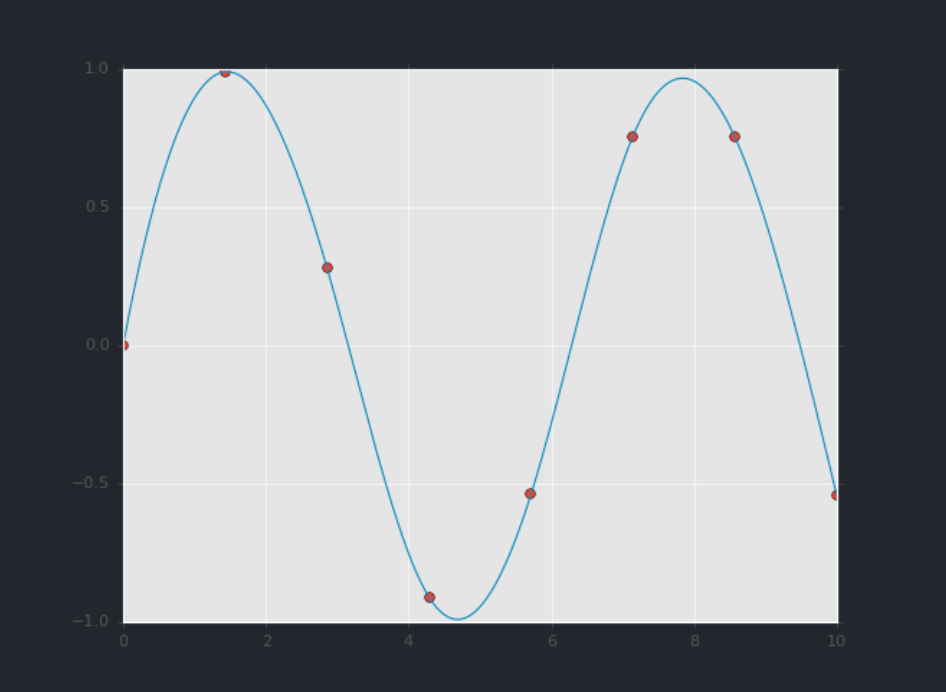

|
<a href="15-رشته‌ها و عبارات باقاعده.md">رشته‌ها و عبارات باقاعده</a>
|
<a href="00-فهرست.md">فهرست</a>
|
<a href="17-منابع برای یادگیری بیشتر.md">منابع برای یادگیری بیشتر</a>
|

<h1>یک پیش‌نمایش از ابزارهای علم داده</h1>

اگر می‌خواهید از این نقطه فراتر بروید و از پایتون برای محاسبات علمی یا علم داده استفاده کنید، چند پکیج وجود دارد که کارتان را بسیار آسان‌تر می‌کنند. این بخش چند مورد از مهم‌ترین آن‌ها را معرفی و پیش‌نمایش می‌کند و به شما ایده‌ای می‌دهد که هر کدام برای چه نوع کاربردی طراحی شده‌اند.
اگر از محیط Anaconda یا Miniconda که در ابتدای این گزارش پیشنهاد شد استفاده می‌کنید، می‌توانید پکیج‌های موردنظر را با دستور زیر نصب کنید:

<pre dir=ltr>

$ conda install numpy scipy pandas matplotlib scikit-learn
</pre>

بیایید به‌صورت مختصر هر یک از این‌ها را به نوبت بررسی کنیم.

<h2>NumPy: پایتون عددی</h2>

NumPy روشی کارآمد برای ذخیره‌سازی و دست‌کاری آرایه‌های متراکم چندبعدی در پایتون فراهم می‌کند. ویژگی‌های مهم NumPy عبارت‌اند از:

<li>یک ساختار ndarray فراهم می‌کند که امکان ذخیره‌سازی و دست‌کاری کارآمد بردارها، ماتریس‌ها و داده‌های چندبعدی را فراهم می‌سازد.</li>
<li>برای کار کردن با این داده‌ها، یک سینتکس خوانا و کارآمد ارائه می‌دهد؛ از محاسبات ساده‌ی عنصر‌به‌عنصر گرفته تا عملیات پیچیده‌تر جبر خطی.</li>

در ساده‌ترین حالت، آرایه‌های NumPy خیلی شبیه لیست‌های پایتون هستند. برای مثال، در اینجا یک آرایه را می‌بینید که بازهٔ عددی ۱ تا ۹ را در خود دارد (این را با تابع داخلی range() در پایتون مقایسه کنید):

<pre dir=ltr>

import numpy as np
x = np.arange(1, 10)
x
</pre>

array([1, 2, 3, 4, 5, 6, 7, 8, 9])

آرایه‌های NumPy هم ذخیره‌سازی کارآمد داده و هم انجام عملیات عنصر‌به‌عنصر را به‌صورت بسیار بهینه فراهم می‌کنند.
برای مثال، برای اینکه هر عنصر آرایه را به توان ۲ برسانیم، می‌توانیم عملگر ** را مستقیماً روی آرایه اعمال کنیم:

<pre dir=ltr>

x ** 2
</pre>

array([ 1,  4,  9, 16, 25, 36, 49, 64, 81])

این را با روش بسیار طولانی‌تر لیست کامپرهنشن در پایتون برای به‌دست آوردن همان نتیجه مقایسه کنید:

<pre dir=ltr>

[val ** 2 for val in range(1, 10)]
</pre>

[1, 4, 9, 16, 25, 36, 49, 64, 81]

بر خلاف لیست‌های پایتون (که محدود به یک بعد هستند)، آرایه‌های NumPy می‌توانند چندبعدی باشند.
برای مثال، در اینجا آرایه‌ی x را به یک آرایه ۳×۳ تبدیل می‌کنیم:

<pre dir=ltr>

M = x.reshape((3, 3))
M
</pre>

array([[1, 2, 3], 
       [4, 5, 6], 
       [7, 8, 9]])

یک آرایهٔ دو بعدی، یکی از شکل‌های نمایش ماتریس است و NumPy می‌داند چگونه عملیات معمول ماتریسی را به‌صورت بهینه انجام دهد.
برای مثال، می‌توانید ترانهاده را با استفاده از T. محاسبه کنید:

<pre dir=ltr>

M.T
</pre>

array([[1, 4, 7], 
       [2, 5, 8], 
       [3, 6, 9]])

یا یک ضرب ماتریس در بردار با استفاده از np.dot انجام دهید:

<pre dir=ltr>

np.dot(M, [5, 6, 7])
</pre>

array([ 38,  92, 146])

و حتی انجام عملیات پیچیده‌تر مانند تجزیه مقادیر ویژه (Eigenvalue Decomposition):

<pre dir=ltr>

np.linalg.eigvals(M)
</pre>

array([  1.61168440e+01,  -1.11684397e+00,  -1.30367773e-15])

چنین دست‌کاری‌های جبر خطی پایه و اساس بسیاری از تحلیل‌های داده‌ی مدرن را تشکیل می‌دهند، به‌ویژه در زمینه‌های یادگیری ماشین و داده‌کاوی.

برای اطلاعات بیشتر درباره‌ی NumPy، <a href="17-منابع برای یادگیری بیشتر.md">به بخش منابع برای یادگیری بیشتر</a> مراجعه کنید.

<h2>Pandas: داده‌های ستونی برچسب‌دار</h2>

Pandas یک پکیج بسیار جدیدتر از NumPy است و در واقع بر پایهٔ آن ساخته شده است. آنچه Pandas ارائه می‌دهد، یک رابط برچسب‌دار برای داده‌های چندبعدی است، به شکل یک شیء DataFrame که برای کاربرانی که با زبان‌های R و زبان‌های مشابه آشنا هستند، بسیار آشنا به نظر می‌رسد.
DataFrameها در Pandas چیزی شبیه به این هستند:

<pre dir=ltr>

import pandas as pd
df = pd.DataFrame({'label': ['A', 'B', 'C', 'A', 'B', 'C'],
                   'value': [1, 2, 3, 4, 5, 6]})
df
</pre>

<table>
    <tr>
        <th></th>
        <th>label</th>
        <th>value</th>
    </tr>
    <tr>
        <td>0</td>
        <td>A</td>
        <td>1</td>
    </tr>
    <tr>
        <td>1</td>
        <td>B</td>
        <td>2</td>
    </tr>
    <tr>
        <td>2</td>
        <td>C</td>
        <td>3</td>
    </tr>
    <tr>
        <td>3</td>
        <td>A</td>
        <td>4</td>
    </tr>
    <tr>
        <td>4</td>
        <td>B</td>
        <td>5</td>
    </tr>
    <tr>
        <td>5</td>
        <td>C</td>
        <td>6</td>
    </tr>
</table>

رابط Pandas به شما این امکان را می‌دهد که کارهایی مانند انتخاب ستون‌ها با نام را انجام دهید:

<pre dir=ltr>

df['label']
</pre>

0    A
1    B
2    C
3    A
4    B
5    C
Name: label, dtype: object

اعمال عملیات متنی روی مقادیر رشته‌ای:

<pre dir=ltr>

df['label'].str.lower()
</pre>

0    a
1    b
2    c
3    a
4    b
5    c
Name: label, dtype: object

اعمال عملیات تجمیعی (Aggregate) روی مقادیر عددی:

<pre dir=ltr>

df['value'].sum()
</pre>

21

و شاید مهم‌تر از همه، انجام اتصال‌ها (Join) و گروه‌بندی‌ها (Grouping) به سبک پایگاه داده به‌صورت کارآمد:

<pre dir=ltr>

df.groupby('label').sum()
</pre>
<table dir=ltr>
    <tr>
        <th align='right'>value</th>
        <th align='left'>label</th>
    </tr>
    <tr>
        <th>A</th>
        <td>5</td>
    </tr>
    <tr>
        <th>B</th>
        <td>7</td>
    </tr>
    <tr>
        <th>C</th>
        <td>9</td>
    </tr>
</table>

در اینجا، با یک خط کد، مجموع تمام اشیایی که برچسب یکسان دارند را محاسبه کرده‌ایم؛ کاری که با استفاده از ابزارهای NumPy و پایتون پایه بسیار طولانی‌تر و کم‌بازده‌تر است.

برای اطلاعات بیشتر دربارهٔ استفاده از Pandas،<a href="17-منابع برای یادگیری بیشتر.md"> به بخش منابع برای یادگیری بیشتر</a> مراجعه کنید.

<h2>Matplotlib: مصورسازی علمی به سبک MatLab</h2>

Matplotlib در حال حاضر محبوب‌ترین پکیج مصورسازی علمی در پایتون است. حتی طرفداران آن هم اعتراف می‌کنند که رابط کاربری‌اش گاهی بیش از حد طولانی است، اما این کتابخانه برای ایجاد طیف گسترده‌ای از نمودارها بسیار قدرتمند است.

برای استفاده از Matplotlib، می‌توانیم ابتدا حالت نوت‌بوک را فعال کنیم (برای استفاده در Jupyter Notebook) و سپس پکیج را با نام مستعار plt وارد کنیم:

<pre dir=ltr>

# run this if using Jupyter notebook
%matplotlib notebook
</pre>

<pre dir=ltr>

import matplotlib.pyplot as plt
plt.style.use('ggplot')  # make graphs in the style of R's ggplot
</pre>

حالا بیایید مقداری داده ایجاد کنیم (به‌صورت آرایه‌های NumPy، طبیعتاً) و نتایج را رسم کنیم:

<pre dir=ltr>

x = np.linspace(0, 10)  # range of values from 0 to 10
y = np.sin(x)           # sine of these values
plt.plot(x, y);         # plot as a line
</pre>

اگر این کد را به‌صورت زنده اجرا کنید، یک نمودار تعاملی خواهید دید که به شما امکان می‌دهد برای بررسی داده‌ها حرکت (Pan)، بزرگ‌نمایی (Zoom) و اسکرول کنید.

این ساده‌ترین نمونه از یک نمودار Matplotlib است؛ برای مشاهده انواع مختلف نمودارها و ایده گرفتن، <a href=http://matplotlib.org/gallery.html>به گالری آنلاین Matplotlib</a> و سایر منابع ذکر شده در <a href="17-منابع برای یادگیری بیشتر.md">بخش منابع برای یادگیری بیشتر</a> مراجعه کنید.

<h2>SciPy: پایتون علمی</h2>

SciPy مجموعه‌ای از قابلیت‌های علمی است که بر پایهٔ NumPy ساخته شده است. این پکیج در ابتدا به‌عنوان مجموعه‌ای از رَپِرهای پایتون برای کتابخانه‌های معروف Fortran در محاسبات عددی آغاز شد و از آن زمان توسعه یافته است.
این پکیج به صورت مجموعه‌ای از زیرماژول‌ها (submodule) سازمان‌دهی شده است که هر کدام یک کلاس از الگوریتم‌های عددی را پیاده‌سازی می‌کنند. در اینجا نمونه‌ای ناقص از مهم‌ترین آن‌ها برای علم داده آورده شده است:

<li>scipy.fftpack: تبدیل فوریه سریع (Fast Fourier Transform)</li>
<li>scipy.integrate: انتگرال‌گیری عددی</li>
<li>scipy.interpolate: درونیابی عددی</li>
<li>scipy.linalg: توابع جبر خطی</li>
<li>scipy.optimize: بهینه‌سازی عددی توابع</li>
<li>scipy.sparse: ذخیره‌سازی ماتریس‌های پراکنده و جبر خطی</li>
<li>scipy.stats: توابع تحلیل آماری</li>

برای مثال، بیایید نگاهی به درونیابی یک منحنی نرم بین چند داده بیندازیم:

<pre dir=ltr>

from scipy import interpolate

# choose eight points between 0 and 10
x = np.linspace(0, 10, 8)
y = np.sin(x)

# create a cubic interpolation function
func = interpolate.interp1d(x, y, kind='cubic')

# interpolate on a grid of 1,000 points
x_interp = np.linspace(0, 10, 1000)
y_interp = func(x_interp)

# plot the results
plt.figure()  # new figure
plt.plot(x, y, 'o')
plt.plot(x_interp, y_interp);
</pre>

آنچه می‌بینیم، یک درونیابی نرم بین نقاط است.

<h2>سایر پکیج‌های علم داده</h2>

بر پایهٔ این ابزارها، مجموعه‌ای از پکیج‌های دیگر علم داده ساخته شده‌اند، از جمله ابزارهای عمومی مانند <a href=http://scikit-learn.org/>Scikit-Learn</a> برای یادگیری ماشین، <a href=http://scikit-image.org/>Scikit-Image</a> برای تحلیل تصویر، و <a href=http://statsmodels.sourceforge.net/>Statsmodels</a> برای مدل‌سازی آماری، همچنین پکیج‌های تخصصی‌تر مانند <a href=http://astropy.org/>AstroPy</a> برای اخترشناسی و فیزیک نجومی، <a href=http://nipy.org/>NiPy</a> برای تصویربرداری عصبی، و بسیاری موارد دیگر.

فرقی نمی‌کند با چه نوع مسئله علمی، عددی یا آماری روبه‌رو هستید؛ احتمالاً یک پکیج پایتون وجود دارد که بتواند به شما در حل آن کمک کند.

|
<a href="15-رشته‌ها و عبارات باقاعده.md">رشته‌ها و عبارات باقاعده</a>
|
<a href="00-فهرست.md">فهرست</a>
|
<a href="17-منابع برای یادگیری بیشتر.md">منابع برای یادگیری بیشتر</a>
|

