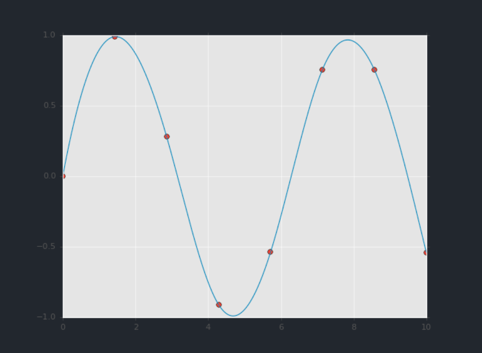

## بازبینی ابزارهای علم داده

اگر می‌خواهید از این نقطه به بعد، در استفاده از پایتون برای محاسبات علمی یا علم داده جلوتر بروید، چندین پackage وجود دارد که کار را بسیار برای شما آسان‌تر می‌کنند.
این بخش به معرفی و مرور چند مورد از مهم‌ترین آن‌ها پرداخته و ایده‌ای از انواع کاربردهایی که برای آن‌ها طراحی شده‌اند، ارائه می‌دهد.
اگر از محیط *Anaconda* یا *Miniconda* که در ابتدای این گزارش پیشنهاد شد استفاده می‌کنید، می‌توانید پکیج‌های مربوطه را با دستور زیر نصب کنید:

```
$ conda install numpy scipy pandas matplotlib scikit-learn
```

بیایید نگاهی مختصر به هر یک از این موارد داشته باشیم.

## NumPy: Numerical Python

NumPy روشی کارآمد برای ذخیره و مدیریت آرایه‌های چگال چندبعدی در پایتون فراهم می‌کند. ویژگی‌های مهم NumPy عبارت‌اند از:

- ساختار ``ndarray`` را ارائه می‌دهد که امکان ذخیره‌سازی و مدیریت کارآمد بردارها، ماتریس‌ها و مجموعه‌داده‌های با ابعاد بالاتر را فراهم می‌کند.
- یک سینتکس خوانا و کارآمد برای عمل‌گیری روی این داده‌ها ارائه می‌دهد؛ از عملیات حسابی ساده بر اساس عناصر گرفته تا عملیات جبر خطی پیچیده‌تر.

در ساده‌ترین حالت، آرایه‌های NumPy بسیار شبیه به لیست‌های پایتون به نظر می‌رسند. به عنوان مثال، در اینجا یک آرایه شامل محدوده اعداد 1 تا 9 آورده شده است (این را با تابع داخلی ``range()`` پایتون مقایسه کنید):

```python
import numpy as np
x = np.arange(1, 10)
x

>>> array([1, 2, 3, 4, 5, 6, 7, 8, 9])
```

آرایه‌های NumPy هم ذخیره‌سازی کارآمد داده و هم انجام عملیات بر روی هر عنصر به صورت بهینه را ارائه می‌دهند.  
برای مثال، برای به توان دو رساندن هر عنصر آرایه، می‌توانیم مستقیماً عملگر "`**`" را روی آرایه اعمال کنیم:

```python
x ** 2

>>> array([ 1,  4,  9, 16, 25, 36, 49, 64, 81])
```

این را با روش طولانی‌تر و مبتنی بر list comprehension در پایتون برای رسیدن به نتیجه‌ای یکسان مقایسه کنید:

```python
[val ** 2 for val in range(1, 10)]

>>> [1, 4, 9, 16, 25, 36, 49, 64, 81]
```

برخلاف لیست‌های پایتون (که به یک بعد محدود هستند)، آرایه‌های NumPy می‌توانند چندبعدی باشند.  
برای مثال، در اینجا آرایه ``x`` خود را به یک آرایه 3x3 تغییر شکل می‌دهیم:

```python
M = x.reshape((3, 3))
M

>>> array([[1, 2, 3],
       [4, 5, 6],
       [7, 8, 9]])
```

یک آرایه دوبعدی، یکی از نمایش‌های یک ماتریس است و NumPy می‌داند چگونه عملیات ماتریسی معمول را به صورت کارآمد انجام دهد. برای مثال، می‌توانید ترانهاده را با استفاده از ``.T`` محاسبه کنید:


```python
M.T

>>> array([[1, 4, 7],
       [2, 5, 8],
       [3, 6, 9]])
```

یا یک ضرب ماتریس-بردار با استفاده از ``np.dot``:

```python
np.dot(M, [5, 6, 7])

>>> array([ 38,  92, 146])
```

و حتی عملیات پیشرفته‌تری مانند تجزیه مقادیر ویژه (eigenvalue decomposition):


```python
np.linalg.eigvals(M)

>>> array([  1.61168440e+01,  -1.11684397e+00,  -1.30367773e-15])
```

چنین دستکاری‌های جبر خطی، پایه‌های بسیاری از تحلیل‌های داده مدرن را تشکیل می‌دهند، به‌ویژه در حوزه‌های یادگیری ماشین و داده‌کاوی.

برای اطلاعات بیشتر در مورد NumPy، به [منابع یادگیری تکمیلی](16-Further-Resources.ipynb) مراجعه کنید.

## Pandas: داده‌های برچسب‌دار ستونی

Pandas یک پکیج بسیار جدیدتر نسبت به NumPy است و در واقع بر پایه آن ساخته شده است.  
آنچه Pandas ارائه می‌دهد، یک رابط برچسب‌دار برای داده‌های چندبعدی است، در قالب یک شی DataFrame که برای کاربران R و زبان‌های مشابه بسیار آشنا به نظر خواهد رسید.  
DataFrameها در Pandas چیزی شبیه به این هستند:


```python
import pandas as pd
df = pd.DataFrame({'label': ['A', 'B', 'C', 'A', 'B', 'C'],
                   'value': [1, 2, 3, 4, 5, 6]})
df

>>> 
label	value
0	A	1
1	B	2
2	C	3
3	A	4
4	B	5
5	C	6
```

رابط Pandas به شما امکان می‌دهد کارهایی مانند انتخاب ستون‌ها بر اساس نام را انجام دهید:

```python
df['label']

>>>
0    A
1    B
2    C
3    A
4    B
5    C
Name: label, dtype: object
```

اعمال عملیات رشته‌ای روی ورودی‌های متنی:

```python
df['label'].str.lower()

>>>
0    a
1    b
2    c
3    a
4    b
5    c
Name: label, dtype: object
```

اعمال توابع تجمیعی روی ورودی‌های عددی:

```python
df['value'].sum()

>>> 21
```

و شاید از همه مهم‌تر، انجام پیوندها و گروه‌بندی‌های کارآمد به سبک پایگاه‌داده:

```python
df.groupby('label').sum()

>>>

value
label	
A	5
B	7
C	9
```

در اینجا تنها با یک خط، مجموع تمام اشیاء دارای برچسب یکسان را محاسبه کرده‌ایم؛ کاری که با استفاده از ابزارهای موجود در NumPy و پایتون پایه، بسیار طولانی‌تر (و بسیار کم‌کارآمدتر) خواهد بود.

برای اطلاعات بیشتر در مورد استفاده از Pandas، به [منابع یادگیری تکمیلی](16-Further-Resources.ipynb) مراجعه کنید.

## Matplotlib: Visualization علمی به سبک متلب

Matplotlib در حال حاضر محبوب‌ترین پکیج visualization علمی در پایتون است. حتی طرفدارانش هم قبول دارند که رابط آن گاهی بیش از حد详细 است، اما این کتابخانه قدرتمند می‌تواند طیف وسیعی از نمودارها را ایجاد کند.

برای استفاده از Matplotlib، ابتدا حالت notebook را فعال می‌کنیم (برای استفاده در Jupyter notebook) و سپس پکیج را با نام ``plt`` import می‌کنیم:

```python
# run this if using Jupyter notebook
%matplotlib notebook
```

```python
import matplotlib.pyplot as plt
plt.style.use('ggplot')  # make graphs in the style of R's ggplot
```

حالا بیایید مقداری داده (البته به صورت آرایه‌های NumPy) ایجاد کرده و نتایج را رسم کنیم:

```python
x = np.linspace(0, 10)  # range of values from 0 to 10
y = np.sin(x)           # sine of these values
plt.plot(x, y);         # plot as a line
```


اگر این کد را به صورت زنده اجرا کنید، یک نمودار تعاملی مشاهده خواهید کرد که به شما امکان می‌دهد با قابلیت pan، zoom و scroll داده‌ها را کاوش کنید.

این ساده‌ترین مثال از یک نمودار Matplotlib است؛ برای آشنایی با طیف گسترده‌ای از انواع نمودارهای موجود، به [گالری آنلاین Matplotlib](http://matplotlib.org/gallery.html) و همچنین سایر مراجع فهرست شده در [منابع یادگیری تکمیلی](16-Further-Resources.ipynb) مراجعه کنید.

## SciPy: Scientific Python

SciPy مجموعه‌ای از قابلیت‌های علمی است که بر پایه NumPy ساخته شده. این پکیج در ابتدا به عنوان مجموعه‌ای از wrapperهای پایتون برای کتابخانه‌های معروف Fortran در محاسبات عددی شروع شد و از آن زمان رشد کرده است. این پکیج به صورت مجموعه‌ای از زیرماژول‌ها سازماندهی شده که هر کدام کلاسی از الگوریتم‌های عددی را پیاده‌سازی می‌کنند. در ادامه نمونه‌ای ناکامل از برخی از مهم‌ترین آن‌ها برای علم داده را مشاهده می‌کنید:

- ``scipy.fftpack``: تبدیل فوریه سریع
- ``scipy.integrate``: انتگرال‌گیری عددی
- ``scipy.interpolate``: درونیابی عددی
- ``scipy.linalg``: روال‌های جبر خطی
- ``scipy.optimize``: بهینه‌سازی عددی توابع
- ``scipy.sparse``: ذخیره‌سازی ماتریس‌های خلوت و جبر خطی
- ``scipy.stats``: روال‌های تحلیل آماری

برای مثال، بیایید نگاهی به درونیابی یک منحنی هموار بین برخی داده‌ها داشته باشیم:

```python
from scipy import interpolate

# choose eight points between 0 and 10
x = np.linspace(0, 10, 8)
y = np.sin(x)

# create a cubic interpolation function
func = interpolate.interp1d(x, y, kind='cubic')

# interpolate on a grid of 1,000 points
x_interp = np.linspace(0, 10, 1000)
y_interp = func(x_interp)

# plot the results
plt.figure()  # new figure
plt.plot(x, y, 'o')
plt.plot(x_interp, y_interp);
```


آنچه مشاهده می‌کنید یک درونیابی هموار بین نقاط داده است.

## سایر پکیج‌های علم داده

بر پایه این ابزارها، مجموعه‌ای از دیگر پکیج‌های علم داده ساخته شده‌اند که شامل ابزارهای عمومی مانند [Scikit-Learn](http://scikit-learn.org) برای یادگیری ماشین، [Scikit-Image](http://scikit-image.org) برای تحلیل تصویر و [Statsmodels](http://statsmodels.sourceforge.net/) برای مدل‌سازی آماری می‌شوند. همچنین پکیج‌های تخصصی‌تر مانند [AstroPy](http://astropy.org) برای نجوم و اخترفیزیک، [NiPy](http://nipy.org/) برای تصویربرداری عصبی و بسیاری دیگر نیز وجود دارند.

مهم نیست با چه نوع مسئله علمی، عددی یا آماری روبرو هستید؛ به احتمال زیاد یک پکیج پایتون وجود دارد که می‌تواند به شما در حل آن کمک کند.

