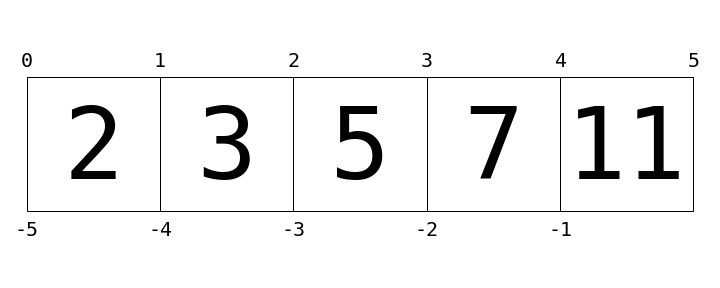

# پیوست: کدهای نمودارها

این بخش شامل کدهای مورد استفاده برای تولید نمودارهایی است که در این گزارش ظاهر شده‌اند.

```python
%matplotlib inline
import matplotlib.pyplot as plt
```

```python
import os
if not os.path.exists('fig'):
    os.makedirs('fig')
```

## بخش ۶: اندیس‌گذاری لیست‌ها

این نمودار به تجسم نحوه عملکرد اندیس‌گذاری در پایتون کمک می‌کند.

```python
L = [2, 3, 5, 7, 11]

fig = plt.figure(figsize=(10, 4))
ax = fig.add_axes([0, 0, 1, 1], xticks=[], yticks=[], frameon=False,
                  aspect='equal')

for i in range(5):
    ax.add_patch(plt.Rectangle([i - 0.5, -0.5], 1, 1, fc='none', ec='black'))
    ax.text(i, -0.05, L[i], size=100,
            ha='center', va='center', family='monospace')
    
for i in range(6):
    ax.text(i - 0.5, 0.55, str(i), size=20,
            ha='center', va='bottom', family='monospace')
    
for i in range(5):
    ax.text(i - 0.5, -0.58, str(-5 + i), size=20,
            ha='center', va='top', family='monospace')
    
ax.axis([-0.7, 4.7, -0.7, 0.7]);

fig.savefig('../img/list-indexing.png');
```
